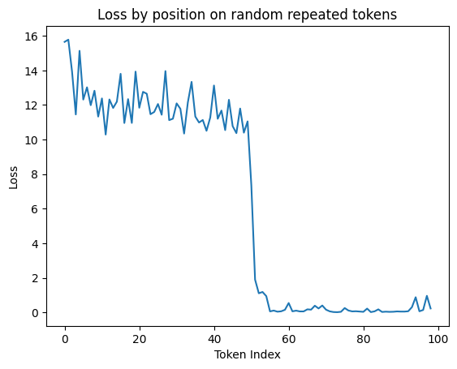
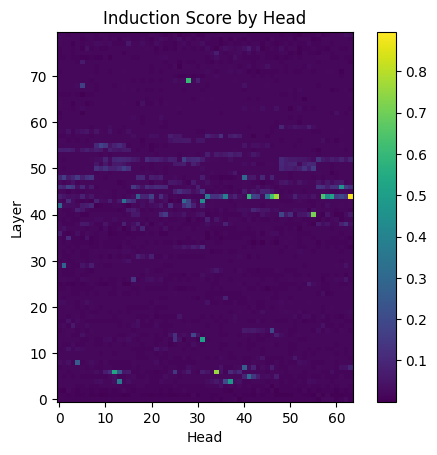

# FlexModel Demos
**Note**: If your system does not have InfiniBand, please be sure to run `export NCCL_IB_DISABLE=1` prior to running the experiments.
## Induction Heads

The file `induction_heads_multigpu.py` takes in a Llama-2 HuggingFace model path and outputs two plots which visualize the per token loss and a heatmap of the induction scores across all attention heads.

Before running the file, you need to insert `DummyModule` from `flex_model.core` in order to store the activation maps. `DummyModule` is just an `nn.Module` that is an identity function and its purpose is to allow us to attach a `HookFunction` at any arbitrary point during a forward pass. An example of this is shown below:

```python
from flex_model.core import DummyModule
...

class LlamaAttention(nn.Module):
    def __init__(...):
        ...
        self.dummy = DummyModule()
        ...

    def forward(...):
        ...
        # attention maps are created once softmax is applied
        attn_weights = nn.functional.softmax(...)

        # pass through DummyModule so we can attach forward hooks
        attn_weights = self.dummy(attn_weights)
        ...
```
You may also need to change the module string literal under the `get_module_names` function. If you do not have safe tensors downloaded as part of your HF model, you will need to pass in `use_safetensors=False` as part of the model loading.

To run the file, you can use `torchrun`. We have tested this demo by running Llama-2-70b-hf on 4x A100-80G.
```
torchrun --nnodes=1 --nproc-per-node=4 induction_heads_multigpu.py --model_path /path/to/llama
```
Example outputs for Llama-2-70b-hf:


